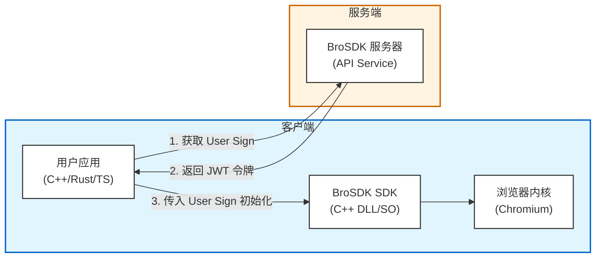

# BroSDK 文档

欢迎使用 BroSDK 文档！BroSDK 是一个基于 C++ 高性能浏览器环境管理和自动化平台。

## 架构概述

BroSDK 由以下核心组件组成：

**核心流程**：
1. 用户使用 **API Key** 从 BroSDK 服务器换取 **User Sign**（JWT 令牌）
2. 使用 User Sign 初始化 SDK
3. 通过 SDK API 调用浏览器内核，创建和管理浏览器环境

## 快速开始

如果你是第一次使用，请从 [快速开始](quick-start.md) 开始，了解如何：

1. 注册账号并创建应用
2. 获取 API Key
3. 获取 User Sign
4. 初始化 SDK

## 文档导航

### 用户指南

- [快速开始](quick-start.md) - 5 分钟快速上手 BroSDK
- [环境管理](user-guide/environment.md) - 管理浏览器环境

### API 参考

- [服务端 API](api/server.md) - 完整的服务端 API 文档
- [SDK 参考](sdk-reference.md) - 完整的 SDK API 文档（C API + HTTP API）

### 集成指南

- [原生 C 集成](integration/c-native.md) - 如何在 C/C++ 项目中集成 SDK

## 相关资源

### 核心资源

| 资源 | 链接 | 说明 |
|------|------|------|
| 🌐 官网 | [https://www.brosdk.com](https://www.brosdk.com) | 官方网站 |
| 📦 C++ SDK | [github.com/browsersdk/brosdk-sdk](https://github.com/browsersdk/brosdk-sdk) | 核心动态库（必需） |
| 🦀 Rust SDK | [github.com/browsersdk/brosdk-sdk-rust](https://github.com/browsersdk/brosdk-sdk-rust) | C++ SDK 的 Rust 封装（需配合 C++ SDK 使用） |
| 📘 TypeScript SDK | [github.com/browsersdk/brosdk-sdk-typescript](https://github.com/browsersdk/brosdk-sdk-typescript) | C++ SDK 的 TS 封装（需配合 C++ SDK 使用） |
| 🔧 浏览器内核 | [github.com/browsersdk/brosdk-core](https://github.com/browsersdk/brosdk-core) | Chromium 内核 |
| 📖 SDK Demo | [github.com/browsersdk/browser-sdk-demo](https://github.com/browsersdk/browser-sdk-demo) | 示例代码 |
| 🚀 Go 服务端 SDK | [github.com/browsersdk/brosdk-server-go](https://github.com/browsersdk/brosdk-server-go) | 服务端 API 封装 |
| 📚 SDK 参考文档 | [sdk-reference.md](sdk-reference.md) | 完整 API 文档 |

## 技术支持

如果遇到问题，请：

1. 查阅文档寻找答案
2. 访问 [GitHub Issues](https://github.com/browsersdk/brosdk-docs/issues) 提交问题
3. 联系技术支持

## 功能特性

- **浏览器环境管理**：创建、更新、查询、销毁浏览器环境
- **指纹配置**：自定义浏览器指纹，避免被检测
- **代理支持**：支持多种代理协议，实现 IP 切换
- **数据持久化**：独立的环境数据，支持 Cookie、历史记录等
- **多种语言支持**：提供 C、TypeScript 等多种语言 SDK
- **灵活的 API**：服务端 API 和 SDK API 两种调用方式

## 贡献

欢迎贡献文档！请查看 [GitHub](https://github.com/browsersdk/brosdk-docs) 了解如何参与贡献。
