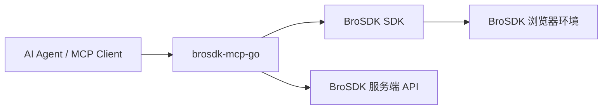

# MCP 使用指南

BroSDK 提供独立的 MCP Server 项目 [`brosdk-mcp-go`](https://github.com/browsersdk/brosdk-mcp-go)，
将浏览器环境管理、浏览器控制和页面自动化能力封装成 MCP Tools，供 Claude Desktop、CodeBuddy 等 AI Agent 直接调用。

这套方案适合两类场景：

- 让 AI Agent 直接操控 BroSDK 浏览器环境
- 把环境管理、浏览器打开、页面操作、录制回放统一为 MCP Tool 调用

## 适用场景

如果你的目标是：

- 让 AI 自动创建和选择浏览器环境
- 让 AI 自动打开页面、点击、输入、截图、导出 PDF
- 复用录制好的浏览器操作流程
- 避免手写 CDP 或 Puppeteer / Playwright 脚本

那么优先使用 `brosdk-mcp-go`。

如果你只是想连接一个已经启动的浏览器调试端口，直接使用 [启动参数与 CDP](../user-guide/browser-launch.md) 中的 Puppeteer、Playwright 或通用 CDP 方案会更直接。

## 架构关系



- MCP Client 通过 `/sse` 和 `/message` 与 `brosdk-mcp-go` 通信
- `brosdk-mcp-go` 内部调用 BroSDK SDK 和服务端 API
- 浏览器环境打开后，MCP Server 还能继续通过 CDP 完成高层页面操作

## 前置要求

| 项目 | 说明 |
| --- | --- |
| 操作系统 | Windows x64 或 macOS arm64 |
| Go | 1.26+ |
| API Key 或 User Sign | 二选一，至少提供一个 |
| BroSDK 原生库 | 可手动提供，也可首次启动时自动下载 |

## 获取与编译

```bash
git clone https://github.com/browsersdk/brosdk-mcp-go.git
cd brosdk-mcp-go
go build -o brosdk-mcp .
```

## 配置

启动时按顺序读取：

1. `config.local.json`
2. `config.json`

前者优先级更高。

### 配置示例

```json
{
  "apiKey": "your-api-key",
  "workDir": "D:/brosdk-data",
  "port": 5811
}
```

### 配置字段说明

| 字段 | 必填 | 说明 |
| --- | --- | --- |
| `apiKey` | 否 | API Key；未提供 `userSig` 时用于自动换取 User Sign |
| `userSig` | 否 | 预先生成的 User Sign，优先级高于 `apiKey` |
| `workDir` | 否 | SDK 工作目录，默认 `./brosdk` |
| `port` | 否 | SDK 浏览器控制端口，默认 `5811` |

!!! warning "凭据要求"
    `apiKey` 和 `userSig` 至少提供一个。两者都缺失时，MCP Server 无法启动。

## 启动 MCP Server

```bash
# 首次运行会自动下载对应平台的原生库
./brosdk-mcp -addr :8765
```

也可以手动指定 BroSDK 原生库路径：

```bash
./brosdk-mcp -lib ./libs/windows-x64/brosdk.dll -addr :8765
```

macOS 示例：

```bash
./brosdk-mcp -lib ./libs/darwin-arm64/libbrosdk.dylib -addr :8765
```

### 启动参数

| 参数 | 说明 |
| --- | --- |
| `-addr` | HTTP 监听地址，默认 `:8765` |
| `-lib` | 手动指定原生库路径；不指定时自动查找或下载 |

## HTTP 端点

| 端点 | 方法 | 说明 |
| --- | --- | --- |
| `/sse` | `GET` | MCP SSE 流 |
| `/message` | `POST` | JSON-RPC 2.0 请求端点 |
| `/inspector` | `GET` | 内嵌 MCP Inspector Web UI |
| `/health` | `GET` | 健康检查 |

## 在 MCP 客户端中接入

### Claude Desktop / CodeBuddy

配置文件示例：

```json
{
  "mcpServers": {
    "brosdk": {
      "url": "http://127.0.0.1:8765/sse"
    }
  }
}
```

如果你本地把服务启动在其他端口，替换上面的 `8765` 即可。

### 验证是否接入成功

接入成功后，MCP Client 应能发现一组 `brosdk` 工具，例如：

- `sdk_info`
- `env_create`
- `env_page`
- `browser_open`
- `browser_navigate`
- `browser_click`
- `browser_screenshot`
- `record_start`
- `scene_replay`

## 常用工作流

### 1. 环境创建与浏览器打开

最常见的链路是：

1. `env_create` 创建浏览器环境
2. `browser_open` 打开该环境
3. 等待 SSE 事件 `browser-open-success`
4. `browser_select` 设为激活环境
5. 调用 `browser_navigate`、`browser_click`、`browser_fill` 等工具

### 2. 页面自动化

高频工具包括：

| Tool | 说明 |
| --- | --- |
| `browser_navigate` | 打开页面 |
| `browser_click` / `browser_click_ref` | 点击元素 |
| `browser_fill` / `browser_fill_ref` | 填写输入框 |
| `browser_wait` | 等待页面、选择器或文本就绪 |
| `browser_snapshot` | 获取页面结构，供 AI 定位元素 |
| `browser_screenshot` | 保存截图 |
| `browser_pdf` | 导出 PDF |

### 3. 录制回放

当某个页面流程重复出现时，可以直接录制：

1. `record_start`
2. 执行若干 `browser_*` 操作
3. `record_stop`
4. `scene_replay`

这样可以把一次操作沉淀成可复用场景，并支持变量替换。

## 异步工具与 SSE 事件

以下工具是异步的：

- `browser_open`
- `browser_close`
- `browser_install`
- `sdk_token_update`

它们会先返回 `reqId`，最终结果通过 SSE 推送。

### 典型返回

```json
{
  "reqId": 42,
  "envId": "abc123"
}
```

### 典型事件

```text
event: sdk-event
data: {"code":100,"data":"{\"type\":\"browser-open-success\",\"reqId\":42,...}"}
```

### 常见事件类型

| 事件类型 | 含义 |
| --- | --- |
| `browser-open-success` | 浏览器已打开，CDP 已就绪 |
| `browser-close-success` | 浏览器已关闭 |
| `token-update-success` | User Sign 刷新成功 |
| `install-success` | 浏览器内核安装完成 |

## 与 CDP 方案的区别

`brosdk-mcp-go` 和通用 CDP 连接方式不是互斥关系，但定位不同：

| 方案 | 适合场景 |
| --- | --- |
| `brosdk-mcp-go` | 让 AI Agent 直接通过 Tool 调用环境管理和页面操作 |
| Puppeteer / Playwright / chrome-devtools-mcp | 已经有固定自动化脚本或只需要连接调试端口 |

如果你需要 AI 能直接“创建环境 -> 打开浏览器 -> 操作页面 -> 录制回放”，那么 `brosdk-mcp-go` 是更完整的入口。

## 推荐排障顺序

如果 MCP Server 启动或调用失败，按这个顺序排查：

1. 检查 `config.local.json` / `config.json` 中是否提供了 `apiKey` 或 `userSig`
2. 访问 `http://127.0.0.1:8765/health` 确认服务已启动
3. 检查原生库是否存在，或自动下载是否成功
4. 检查 `workDir` 是否可写
5. 如果是异步工具无结果，确认 MCP Client 已建立 SSE 连接

## 相关链接

- [`brosdk-mcp-go`](https://github.com/browsersdk/brosdk-mcp-go)
- [服务端 API](../api/server.md)
- [环境管理](../user-guide/environment.md)
- [启动参数与 CDP](../user-guide/browser-launch.md)
