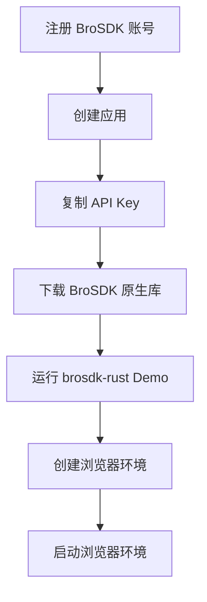
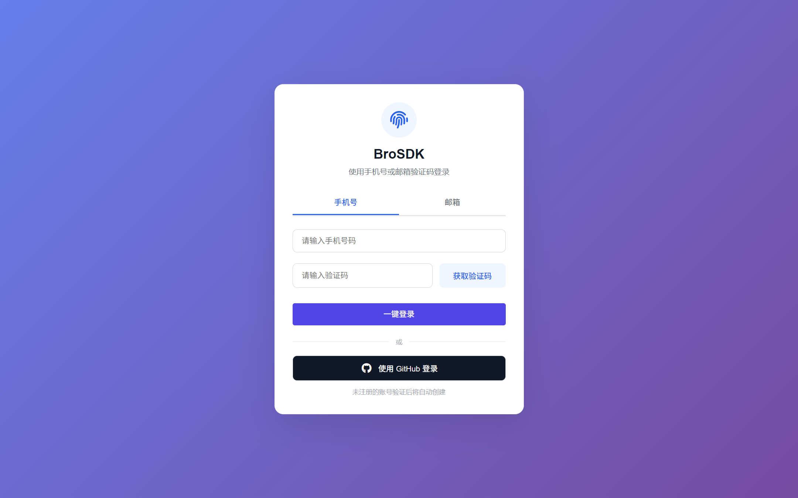
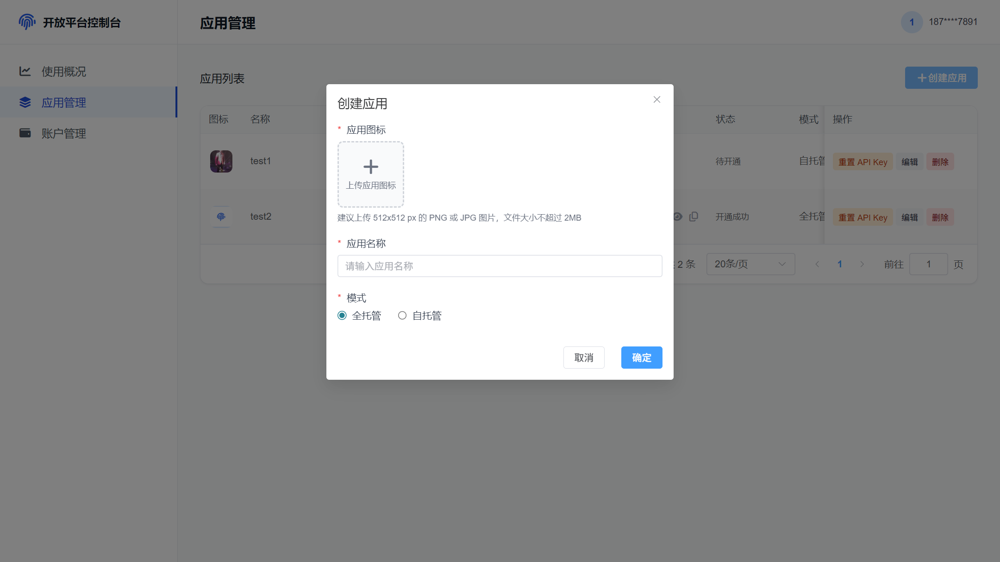
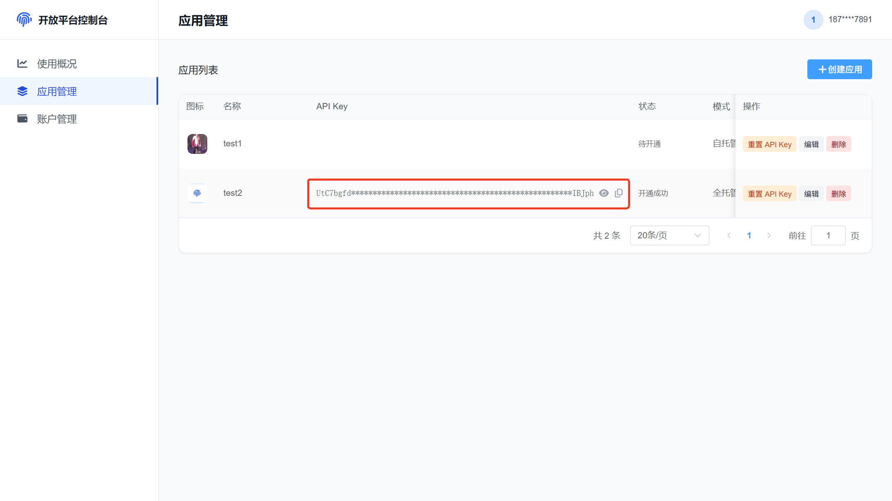
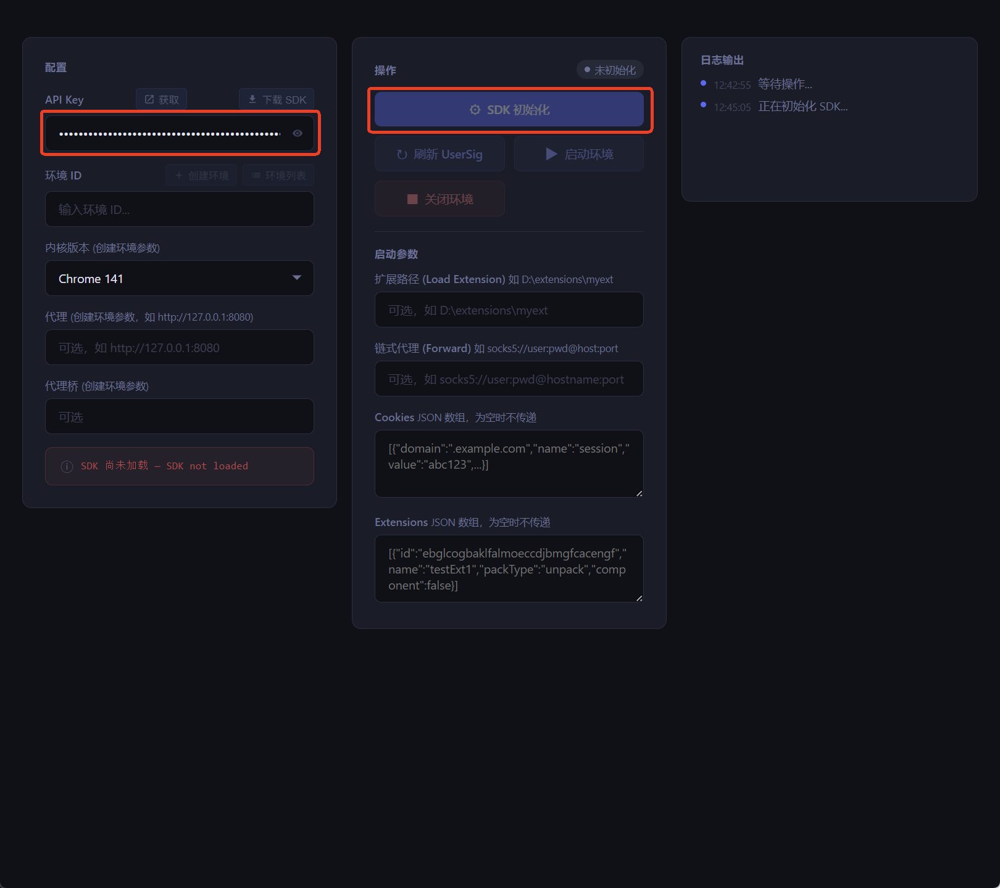
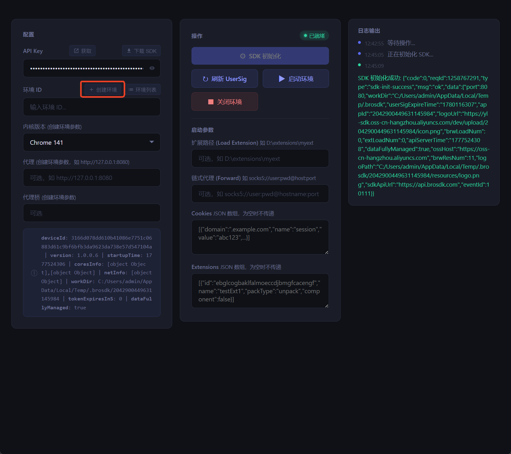
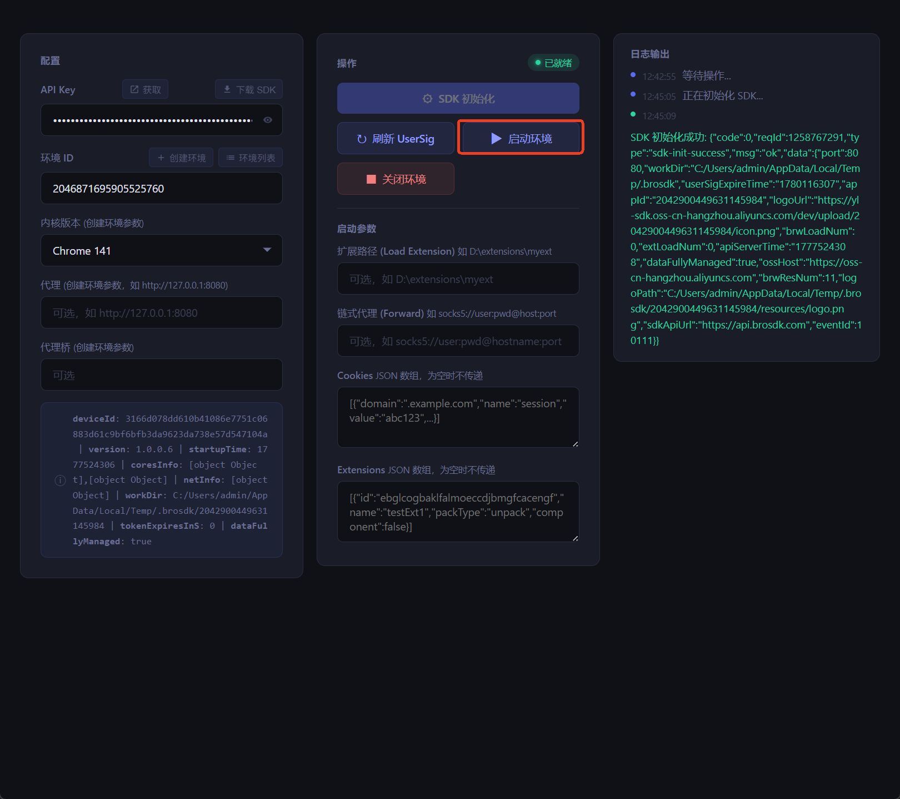

# 快速开始：运行 BroSDK Rust Demo

本指南帮助你用最短路径跑通 BroSDK：注册账号、创建应用、获取 API Key、下载原生库、运行 [brosdk-rust](https://github.com/browsersdk/brosdk-rust) Demo，并启动第一个浏览器环境。

完成后，你将看到一个由 BroSDK 管理的独立浏览器环境。后续可以基于同一套流程接入 C/C++、TypeScript、Python、Rust 或服务端系统。

## 你将完成什么



## 准备工作

| 项目 | 要求 |
|------|------|
| BroSDK 账号 | 用于登录控制台并创建应用 |
| API Key | 从应用详情页复制，用于 Demo 初始化 |
| Git | 用于克隆 `brosdk-rust` |
| Rust | 建议使用稳定版 Rust 工具链 |
| Tauri 依赖 | Demo 是 Tauri 桌面应用，需要满足 Tauri v2 前置条件 |
| BroSDK 原生库 | 从 [brosdk releases](https://github.com/browsersdk/brosdk/releases) 下载 |

!!! note "平台说明"
    本指南以 Windows 为主。下载原生库后，将 `brosdk.dll` 放到 `libs/windows-x64/brosdk.dll`。macOS 用户可参考 `brosdk-rust` README 中的 macOS 动态库目录说明。

## 步骤 1：注册并登录账号

访问 [BroSDK 用户中心](https://www.brosdk.com)，使用手机号或邮箱登录。

如果是首次使用，系统会自动完成账号注册。后续登录只需要手机号/邮箱和验证码。

{ width="900" }

## 步骤 2：创建应用

登录后进入应用管理页面，创建一个用于 Demo 调试的应用。

建议使用容易识别的名称，例如 `Rust Demo Test`。应用创建后会生成 API Key，Demo 会用它换取 SDK 初始化所需的凭据。

{ width="900" }

## 步骤 3：复制 API Key

进入应用详情页，复制 API Key。

API Key 是敏感凭据，只应在服务端或本地调试工具中使用。不要把 API Key 写入前端静态代码、公开仓库或日志。

{ width="900" }

## 步骤 4：克隆 Rust Demo

```bash
git clone https://github.com/browsersdk/brosdk-rust.git
cd brosdk-rust
```

## 步骤 5：下载并放置原生库

从 BroSDK Releases 下载对应平台的原生库：

[https://github.com/browsersdk/brosdk/releases](https://github.com/browsersdk/brosdk/releases)

Windows 解压后，将动态库放到以下路径：

```text
brosdk-rust/
└── libs/
    └── windows-x64/
        └── brosdk.dll
```

也就是：

```text
libs/windows-x64/brosdk.dll
```

!!! warning "路径必须正确"
    如果 Demo 启动后提示找不到原生库，优先检查 `libs/windows-x64/brosdk.dll` 是否存在，以及文件是否被安全软件拦截。

## 步骤 6：运行 Rust Demo

在 `brosdk-rust` 目录执行：

```bash
cargo run --bin brosdk-demo
```

如果你第一次运行 Tauri 项目，可能需要先安装系统依赖。请参考：

[https://v2.tauri.app/start/prerequisites/](https://v2.tauri.app/start/prerequisites/)

## 步骤 7：初始化 SDK

Demo 启动后，在界面中输入刚才复制的 API Key，然后点击初始化 SDK。

初始化过程会用 API Key 获取 SDK 凭据，并加载本地 `brosdk.dll`。如果初始化失败，先检查 API Key 是否正确、原生库路径是否正确。

{ width="900" }

## 步骤 8：创建浏览器环境

初始化成功后，在 Demo 中选择浏览器内核版本并创建环境。

环境是 BroSDK 的核心概念。每个环境可以维护独立的浏览器配置、指纹参数、Cookie、Storage 和会话状态。

{ width="900" }

## 步骤 9：启动浏览器环境

选择刚创建的环境，点击启动。

首次启动时，SDK 可能需要下载浏览器内核。下载和启动耗时取决于网络环境，请等待 Demo 中的启动状态更新。启动成功后，会打开一个由 BroSDK 管理的独立浏览器窗口。

{ width="900" }

## 常见问题

### API Key 无效或初始化失败

检查 API Key 是否来自当前账号下的有效应用。不要复制多余空格，也不要使用已经删除或禁用的应用。

### 找不到 `brosdk.dll`

确认文件路径为：

```text
libs/windows-x64/brosdk.dll
```

如果你从其他目录启动 Demo，也要确认当前工作目录仍是 `brosdk-rust` 项目根目录。

### 首次启动浏览器很慢

首次启动可能会下载浏览器内核，这是正常现象。后续同一内核版本会复用本地缓存。

### 浏览器启动失败

优先检查：

- SDK 是否初始化成功。
- 环境 ID 是否正确。
- 原生库是否完整解压。
- 工作目录是否可写。
- 网络是否能访问内核下载地址。

### macOS 如何放置动态库

macOS 用户请将 `brosdk.dylib` 放到 `brosdk-rust` README 中说明的 macOS 目录，并在 macOS 主机上运行或打包 Tauri 应用。

## 下一步

- [环境管理](user-guide/environment.md)：理解环境创建、更新、分页查询和销毁。
- [启动参数与 CDP](user-guide/browser-launch.md)：了解启动参数、CDP 和自动化连接方式。
- [Rust 集成](integration/rust.md)：把 Demo 中的调用方式接入你自己的 Rust 或 Tauri 项目。
- [SDK 参考](sdk-reference.md)：查看完整 SDK API、返回码和事件说明。
