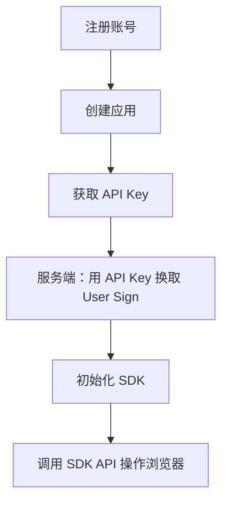

# 快速开始

欢迎使用 BroSDK！本指南将帮助你快速上手并开始使用浏览器环境管理服务。

## 简介

BroSDK 是一个基于 C++ 高性能浏览器环境管理和自动化平台，提供浏览器指纹管理、代理调度、环境隔离等核心功能。

### 核心组件

| 组件 | 说明 |
|------|------|
| **SDK** | C++ 动态库（`brosdk.dll` / `brosdk.so` / `brosdk.dylib`） |
| **浏览器内核** | 基于 Chromium 的定制浏览器内核 |
| **服务端** | 提供 API Key 认证和 User Sign 颁发 |

### 快速流程概览



---

## SDK 安装

### 1. 下载 SDK

从 GitHub 下载对应平台的 SDK：

| 平台 | 架构 | 状态 |
|------|------|------|
| Windows | x64 | ✅ 已发布 |
| Linux | x64 | 🚧 开发中 |
| macOS | x64/arm64 | 🚧 开发中 |

**下载地址**：[github.com/browsersdk/brosdk](https://github.com/browsersdk/brosdk/releases)

> 💡 **浏览器内核自动下载**：SDK 会在首次运行时自动下载并管理浏览器内核，无需手动下载。

### 2. 目录结构

```plaintext
C:/brosdk/
├── userdata/                # Chrome 用户数据目录（自动创建）
│   ├── env1/                # 环境 1 数据
│   ├── env2/                # 环境 2 数据
│   └── ...
└── data/                    # 导出数据目录（BroSDK 自动从 userdata 导出）
```

**重要**：
- `userdata/` 和 `data/` 目录会在首次运行时自动创建
- `userdata/` 存储 Chrome 原始用户数据
- `data/` 是 BroSDK 从 userdata 导出的数据

---

## 身份验证配置

### 第一步：注册账号

访问 [BroSDK 用户中心](https://www.brosdk.com) 完成用户注册。

**注册流程**：
1. 访问官网用户中心
2. 输入**手机号**或**邮箱**
3. 获取并填写验证码
4. 完成登录

> 💡 **无需预先注册，无需设置密码**  
> 如果是首次使用，系统会自动注册账号。后续登录只需输入手机号/邮箱 + 验证码即可。

### 第二步：创建应用

注册完成后，创建一个应用（APP）来获取 API Key：

1. 登录用户中心
2. 进入"我的应用"
3. 点击"创建应用"
4. 填写应用信息（名称、描述）
5. 点击"创建"

### 第三步：获取 API Key

API Key 用于服务端 API 的身份认证：

1. 进入"我的应用"
2. 选择你创建的应用
3. 在应用详情中找到 **API Key**
4. 点击复制

⚠️ **重要**：API Key 仅用于服务端调用，**永远不要在客户端代码中暴露**

### 第四步：获取 User Sign

User Sign 是用于 SDK 初始化的 JWT 令牌。

**API 接口**：`POST /api/v2/browser/getUserSig`

**请求示例**：
```http
POST https://api.brosdk.com/api/v2/browser/getUserSig
Authorization: Bearer YOUR_API_KEY
Content-Type: application/json

{
  "customerId": "user_12345",
  "duration": 86400
}
```

**响应示例**：
```json
{
  "code": 200,
  "msg": "OK",
  "data": {
    "userSig": "eyJhbGciOiJSUzI1NiIsInR5cCI6IkpXVCJ9..."
  }
}
```

### 第五步：初始化 SDK

根据你的开发语言，选择对应的集成指南：

| 语言 | 集成指南 | 说明 |
|------|----------|------|
| C / C++ | [C 语言集成](integration/c-native.md) | 直接调用 C API |
| TypeScript / Electron | [TypeScript 集成](integration/typescript.md) | 通过 koffi 调用原生库 |
| Rust / Tauri | [Rust 集成](integration/rust.md) | 通过 libloading 动态加载 |

选择你的开发语言，查看详细的初始化代码和示例：

- [C 语言集成](integration/c-native.md)
- [TypeScript 集成](integration/typescript.md)
- [Rust 集成](integration/rust.md)

> 💡 **快速上手**：集成指南中包含完整的初始化代码、错误处理和最佳实践，推荐先阅读再开始开发。

---

## 相关资源

| 资源 | 链接 | 说明 |
|------|------|------|
| 🌐 官网 | [brosdk.com](https://www.brosdk.com) | 官方网站 |
| 📦 C++ SDK | [github.com/browsersdk/brosdk](https://github.com/browsersdk/brosdk/releases) | 核心动态库（必需） |
| 📘 TypeScript SDK | [github.com/browsersdk/brosdk-typescript](https://github.com/browsersdk/brosdk-typescript) | C++ SDK 的 TS 封装 |
| 🦀 Rust SDK | [github.com/browsersdk/brosdk-rust](https://github.com/browsersdk/brosdk-rust) | C++ SDK 的 Rust 封装 |
| 📖 SDK Demo | [github.com/browsersdk/browser-demo](https://github.com/browsersdk/browser-demo) | 示例代码 |
| 🚀 Go 服务端 SDK | [github.com/browsersdk/brosdk-server-go](https://github.com/browsersdk/brosdk-server-go) | 服务端 API 封装 |

> 💡 **浏览器内核**：SDK 会在首次运行时自动下载浏览器内核，无需手动下载。

---

## 下一步

- [环境管理](user-guide/environment.md) - 学习如何创建和管理浏览器环境
- [服务端 API 参考](api/server.md) - 查看完整的服务端 API 文档
- [SDK 参考](sdk-reference.md) - 查看完整的 SDK API 文档
- [原生 C 集成指南](integration/c-native.md) - 学习如何集成 SDK
