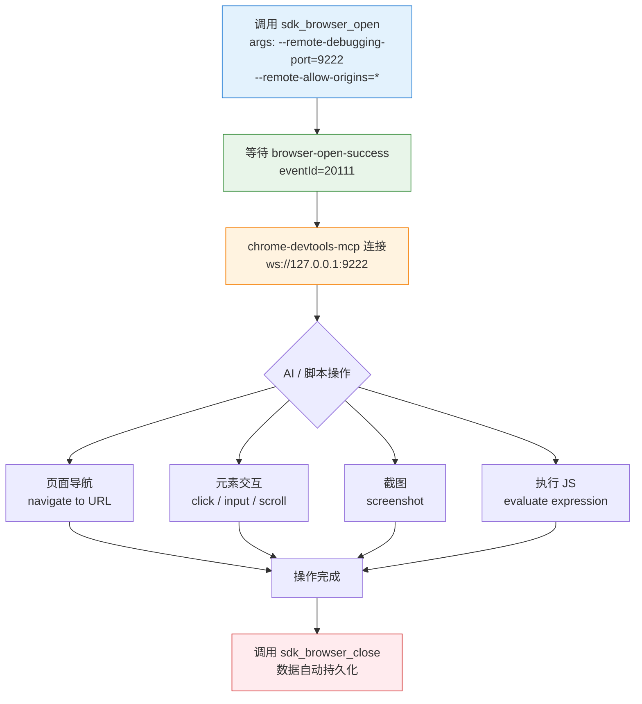

# 环境启动参数与 CDP 连接

本文介绍如何在启动浏览器环境时传入自定义参数（Chromium 启动参数），以及如何通过 Chrome DevTools Protocol（CDP）远程连接并自动化操作已启动的浏览器环境。

---

## 启动参数（args）

`sdk_browser_open` / `POST /sdk/v1/browser/open` 接口的每个环境对象支持 `args` 字段，用于追加任意 Chromium 启动参数。

### 请求结构

```json
{
  "envs": [
    {
      "envId": "2037495132382564352",
      "args": [
        "--no-first-run",
        "--remote-debugging-port=9222"
      ],
      "urls": ["https://example.com"]
    }
  ]
}
```

### 参数字段说明

| 字段 | 类型 | 必填 | 说明 |
| --- | --- | --- | --- |
| `envId` | string | 是 | 环境 ID（64 位整数字符串形式） |
| `args` | array\<string\> | 否 | 追加的 Chromium 启动参数列表 |
| `urls` | array\<string\> | 否 | 启动后自动打开的 URL 列表 |
| `cookies` | array | 否 | 随启动注入的 Cookie 数组 |
| `extensions` | array | 否 | 需要加载的扩展列表 |

---

## cookies 字段说明

`cookies` 用于在启动浏览器时向指定环境注入 Cookie，格式与 WebExtension API（`chrome.cookies`）兼容，可直接传入从浏览器导出的 Cookie JSON 数据。

### 数据结构

```json
[
  {
    "domain": ".example.com",
    "expirationDate": 1700000000,
    "hostOnly": false,
    "httpOnly": true,
    "name": "session_id",
    "path": "/",
    "sameSite": "lax",
    "secure": true,
    "session": false,
    "storeId": "",
    "value": "abc123"
  }
]
```

### 字段说明

| 字段 | 类型 | 必填 | 说明 |
| --- | --- | --- | --- |
| `domain` | string | 是 | Cookie 所属域名。以 `.` 开头表示对所有子域名生效（如 `.example.com`）；不带点则仅限当前主机（`hostOnly` 效果） |
| `name` | string | 是 | Cookie 名称 |
| `value` | string | 是 | Cookie 值 |
| `path` | string | 否 | Cookie 有效路径，通常为 `/`，表示全站有效 |
| `expirationDate` | number | 否 | 过期时间（Unix 时间戳，秒级，支持小数）。不传或传 `session=true` 时为会话 Cookie，浏览器关闭后失效 |
| `hostOnly` | boolean | 否 | 是否仅限当前主机（不含子域名）。`true` 时 `domain` 不含前缀点，`false` 时对子域名也生效 |
| `httpOnly` | boolean | 否 | 是否为 HttpOnly Cookie（JS 无法通过 `document.cookie` 读取） |
| `secure` | boolean | 否 | 是否仅在 HTTPS 连接下传输 |
| `session` | boolean | 否 | 是否为会话 Cookie。`true` 时忽略 `expirationDate`，浏览器关闭即失效 |
| `sameSite` | string | 否 | 跨站请求策略：`"strict"` 完全禁止跨站、`"lax"` 允许导航时携带、`"no_restriction"` 不限制（等同 `None`，需配合 `secure=true`） |
| `storeId` | string/null | 否 | Cookie 存储 ID，通常留空（`""` 或 `null`）即可，SDK 会使用当前环境的默认存储 |

### 使用示例

```json
{
  "envs": [
    {
      "envId": "2037495132382564352",
      "args": ["--no-first-run"],
      "cookies": [
        {
          "domain": ".baidu.com",
          "expirationDate": 1808188306.943,
          "hostOnly": false,
          "httpOnly": true,
          "name": "BDUSS",
          "path": "/",
          "sameSite": "no_restriction",
          "secure": true,
          "session": false,
          "storeId": null,
          "value": "YOUR_COOKIE_VALUE_HERE"
        }
      ]
    }
  ]
}
```

> **提示**：`cookies` 字段注入的 Cookie 会覆盖环境中已有的同名 Cookie。如需保留历史登录状态，建议只注入必要的鉴权 Cookie（如 `session_id`、`token` 等），避免全量覆盖。

---

## extensions 字段说明

`extensions` 用于在启动环境时加载自定义 Chrome 扩展，并支持通过 `data` 字段向扩展透传初始化数据。

### 扩展文件放置

在 SDK 初始化目录（`workDir`）下有一个 `extensions/` 文件夹，将**解包后的扩展目录**（含 `manifest.json`）放入其中：

```
workDir/
└── extensions/
    ├── testExt1/          ← 解包扩展目录（manifest.json 在此层级）
    │   ├── manifest.json
    │   ├── background.js
    │   └── ...
    └── testExt2/
        ├── manifest.json
        └── ...
```

### 数据结构

```json
[
  {
    "name": "testExt1",
    "id": "ebglcogbaklfalmoeccdjbmgfcacengf",
    "packType": "unpack",
    "component": false,
    "data": {
      "key1": "aGVsbG8=",
      "key2": "5L2g5aW9",
      "key3": "12345234634574568478asdfdgsdfg"
    }
  }
]
```

### 字段说明

| 字段 | 类型 | 必填 | 说明 |
| --- | --- | --- | --- |
| `name` | string | 是 | 扩展目录名，对应 `${workDir}/extensions/<name>` 路径下的解包扩展文件夹 |
| `id` | string | 是 | 扩展的固定 Chrome Extension ID。扩展 ID 由 `key` 字段（在 `manifest.json` 中）或开发者账号决定，**用户必须预先知晓**，不可省略 |
| `packType` | string | 是 | 扩展打包类型，目前固定为 `"unpack"`（解包模式），保持默认即可 |
| `component` | boolean | 是 | 是否为组件扩展（Component Extension），通常为 `false`，保持默认即可 |
| `data` | object | 否 | 向扩展透传的键值对数据。键为任意字符串，值为字符串（建议 Base64 编码二进制或 JSON 内容）。SDK 启动时会将这些数据写入扩展的 `chrome.storage.local`，扩展内可直接读取 |

### 扩展内读取透传数据

SDK 将 `data` 字段中的键值对写入 `chrome.storage.local`，扩展的 `background.js` 或 `content_script.js` 可通过标准 API 读取：

```javascript
// 读取单个 key
const result = await chrome.storage.local.get('key1');
console.log(result.key1); // "aGVsbG8="

// 批量读取
const data = await chrome.storage.local.get(['key1', 'key2', 'key3']);
console.log(data);
// { key1: "aGVsbG8=", key2: "5L2g5aW9", key3: "12345234634574568478asdfdgsdfg" }
```

### 使用示例

```json
{
  "envs": [
    {
      "envId": "2037495132382564352",
      "args": ["--no-first-run"],
      "extensions": [
        {
          "name": "myLoginHelper",
          "id": "ebglcogbaklfalmoeccdjbmgfcacengf",
          "packType": "unpack",
          "component": false,
          "data": {
            "accessToken": "eyJhbGciOiJIUzI1NiIsInR5cCI6IkpXVCJ9...",
            "userId": "dXNlcl8xMjM0NQ==",
            "config": "eyJlbnYiOiJwcm9kIn0="
          }
        }
      ]
    }
  ]
}
```

> **提示**：`data` 字段的值为字符串类型，建议对复杂数据使用 Base64 编码后传入，扩展内解码后使用。扩展 ID 可在 `chrome://extensions/` 开发者模式下查看，或在 `manifest.json` 的 `key` 字段中计算得出。

---

## 常用 Chromium 启动参数

### 基础行为参数

| 参数 | 说明 |
| --- | --- |
| `--no-first-run` | 禁用首次运行向导 |
| `--no-default-browser-check` | 禁用默认浏览器检测提示 |
| `--disable-web-security` | 禁用同源策略（仅调试用） |
| `--remote-allow-origins=*` | 允许所有来源的 CDP 连接（配合 `--remote-debugging-port` 使用） |
| `--start-maximized` | 启动时最大化窗口 |
| `--window-size=1280,800` | 指定窗口尺寸 |
| `--window-position=0,0` | 指定窗口位置 |
| `--lang=zh-CN` | 强制设置浏览器界面语言 |

### 网络与代理参数

| 参数 | 说明 |
| --- | --- |
| `--proxy-server=socks5://127.0.0.1:1080` | 指定代理服务器 |
| `--proxy-bypass-list=localhost,127.0.0.1` | 代理绕过列表 |
| `--no-proxy-server` | 禁用代理 |
| `--host-resolver-rules="MAP * ~NOTFOUND, EXCLUDE 127.0.0.1"` | 自定义 DNS 解析规则 |

### CDP 远程调试参数

| 参数 | 说明 |
| --- | --- |
| `--remote-debugging-port=9222` | **开启 CDP 远程调试端口**（用于 Puppeteer / Playwright / MCP 连接） |
| `--remote-debugging-address=0.0.0.0` | 允许外部 IP 连接调试（默认仅 127.0.0.1） |
| `--remote-allow-origins=*` | 允许跨源 WebSocket 连接（CDP 必须配合使用） |

### 自定义参数

| 参数 | 说明 |
| --- | --- |
| `--client-appicon=<path>` | 自定义浏览器窗口图标（SDK 扩展参数） |
| `--user-agent=<ua>` | 覆盖 User-Agent |
| `--disable-blink-features=AutomationControlled` | 隐藏自动化特征（反检测） |

### macOS 专属参数

| 参数 | 说明 |
| --- | --- |
| `--parent-bundle-identifier=<bundle-id>` | **macOS 必填**。传入宿主 App 的 Bundle Identifier（如 `com.example.myapp`）。macOS 系统要求子进程声明宿主应用身份，不传会导致浏览器无法正常启动 |

**示例**：

```json
{
  "envs": [
    {
      "envId": "2037495132382564352",
      "args": [
        "--no-first-run",
        "--parent-bundle-identifier=com.example.myapp"
      ]
    }
  ]
}
```

---

## 完整启动示例

```json
{
  "envs": [
    {
      "envId": "2037495132382564352",
      "args": [
        "--no-first-run",
        "--no-default-browser-check",
        "--remote-debugging-port=9222",
        "--remote-allow-origins=*",
        "--window-size=1280,800"
      ],
      "urls": [
        "https://example.com"
      ]
    }
  ]
}
```

---

## 通过 CDP 连接操作浏览器

启动浏览器时传入 `--remote-debugging-port=9222` 后，可通过 CDP（Chrome DevTools Protocol）协议对浏览器进行完整的远程控制，包括点击、截图、抓包、执行 JS 等。

### CDP 端口说明

- 默认情况下，CDP 仅监听 `127.0.0.1:9222`
- 若需外部访问，需同时传入 `--remote-debugging-address=0.0.0.0`
- **每个环境实例建议使用不同端口**，避免端口冲突（如 9222、9223、9224...）

```json
{
  "envs": [
    { "envId": "1111111111111111111", "args": ["--remote-debugging-port=9222", "--remote-allow-origins=*"] },
    { "envId": "2222222222222222222", "args": ["--remote-debugging-port=9223", "--remote-allow-origins=*"] },
    { "envId": "3333333333333333333", "args": ["--remote-debugging-port=9224", "--remote-allow-origins=*"] }
  ]
}
```

---

## 使用 chrome-devtools-mcp 连接环境

`chrome-devtools-mcp` 是一个基于 Node.js 的 MCP（Model Context Protocol）服务器，将 CDP 能力封装为 AI 可调用的工具，适合在 AI 辅助自动化场景中使用。

### 安装依赖

确保已安装 Node.js（建议 18+）：

```bash
node --version   # 应为 v18+
```

### 配置 MCP 服务器

在 WorkBuddy / Cursor / VS Code 等支持 MCP 的 IDE 中，将以下配置写入 MCP 配置文件（`~/.workbuddy/mcp.json`）：

```json
{
  "mcpServers": {
    "chrome-devtools": {
      "command": "npx",
      "args": [
        "@browsertoolsai/chrome-devtools-mcp@latest",
        "--port", "9222"
      ]
    }
  }
}
```

> `--port` 对应浏览器启动时指定的 `--remote-debugging-port` 端口号。

### 完整操作流程



### Node.js 代码示例

以下示例展示了如何通过 Node.js 脚本：先调用 SDK Web API 启动浏览器，再通过 CDP 操作页面。

```javascript
import puppeteer from 'puppeteer-core';
import fetch from 'node-fetch';

const SDK_BASE_URL = 'http://127.0.0.1:9527'; // SDK Web API 端口
const ENV_ID = '2037495132382564352';
const CDP_PORT = 9222;

async function main() {
  // 1. 通过 SDK Web API 启动浏览器（启用 CDP）
  const openRes = await fetch(`${SDK_BASE_URL}/sdk/v1/browser/open`, {
    method: 'POST',
    headers: { 'Content-Type': 'application/json' },
    body: JSON.stringify({
      envs: [{
        envId: ENV_ID,
        args: [
          '--no-first-run',
          '--no-default-browser-check',
          `--remote-debugging-port=${CDP_PORT}`,
          '--remote-allow-origins=*',
        ],
        urls: ['https://example.com'],
      }],
    }),
  });
  console.log('open:', await openRes.json());

  // 2. 等待浏览器启动完成（实际项目中建议监听 SDK 事件回调）
  await new Promise(r => setTimeout(r, 3000));

  // 3. 通过 CDP 连接浏览器
  const browser = await puppeteer.connect({
    browserURL: `http://127.0.0.1:${CDP_PORT}`,
    defaultViewport: null,
  });

  const pages = await browser.pages();
  const page = pages[0];

  // 4. 操作页面
  await page.goto('https://example.com');
  const title = await page.title();
  console.log('页面标题:', title);

  const screenshot = await page.screenshot({ path: 'screenshot.png' });
  console.log('截图已保存: screenshot.png');

  // 5. 执行 JavaScript
  const result = await page.evaluate(() => document.querySelector('h1')?.innerText);
  console.log('H1 内容:', result);

  // 6. 断开 CDP 连接（不关闭浏览器进程）
  await browser.disconnect();

  // 7. 通过 SDK 关闭浏览器（自动持久化数据）
  const closeRes = await fetch(`${SDK_BASE_URL}/sdk/v1/browser/close`, {
    method: 'POST',
    headers: { 'Content-Type': 'application/json' },
    body: JSON.stringify({ envs: [ENV_ID] }),
  });
  console.log('close:', await closeRes.json());
}

main().catch(console.error);
```

安装依赖：

```bash
npm install puppeteer-core node-fetch
```

---

## 使用 Playwright 连接

Playwright 同样支持通过 CDP 连接到已有浏览器实例：

```javascript
import { chromium } from 'playwright';

const CDP_PORT = 9222;

// 连接到已启动的浏览器
const browser = await chromium.connectOverCDP(`http://127.0.0.1:${CDP_PORT}`);
const context = browser.contexts()[0];
const page = context.pages()[0];

// 操作页面
await page.goto('https://example.com');
console.log(await page.title());

// 断开连接（不关闭浏览器进程）
await browser.close();
```

---

## 注意事项

!!! warning "端口冲突"
    批量启动多个环境时，每个环境必须使用不同的 CDP 端口，否则后启动的环境将占用相同端口导致连接失败。

!!! warning "macOS 必须传入 --parent-bundle-identifier"
    在 macOS 上启动环境时，**必须**在 `args` 中添加 `--parent-bundle-identifier=<你的 App Bundle ID>`，否则浏览器进程无法正常启动。Bundle Identifier 在 Xcode 项目的 `Info.plist` 中查看（字段 `CFBundleIdentifier`），例如 `com.example.myapp`。

!!! tip "连接时机"
    建议在收到 `browser-open-success`（`eventId=20111`）事件后再发起 CDP 连接，确保浏览器进程已完全就绪。

!!! info "数据持久化"
    CDP 连接只是远程控制接口，不影响 SDK 的数据持久化机制。调用 `sdk_browser_close` 后，Cookie 和 Storage 数据仍会自动保存。

!!! warning "安全提示"
    `--remote-debugging-port` 默认仅监听 `127.0.0.1`，如需对外暴露需评估安全风险。生产环境不建议使用 `--remote-debugging-address=0.0.0.0`。

---

## 相关文档

- [环境管理](environment.md) - 环境的创建、更新与销毁
- [SDK 参考](../sdk-reference.md) - sdk_browser_open 完整接口文档
- [TypeScript 集成](../integration/typescript.md) - TypeScript SDK 使用指南
